# event-management-gui

This template should help get you started developing with Vue 3 in Vite.

## This app use Vue js and library bootstrap 5, toastr, sweetalert, jquery, axios and font-awasome

## Project Setup

```sh
npm install
```

### Compile and Hot-Reload for Development

```sh
npm run dev
```

## "# event-management-gui"

## Features:

## 1. After npm run then open browser and paste Url: http://localhost:5173/

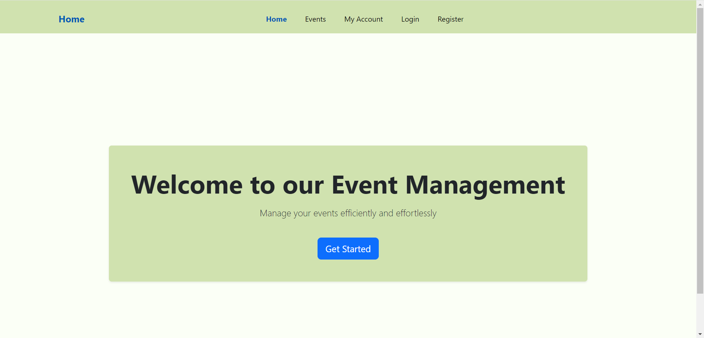

## 2. Register:

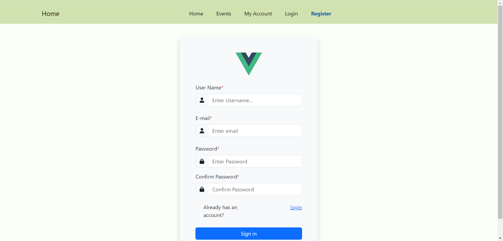

## with error:

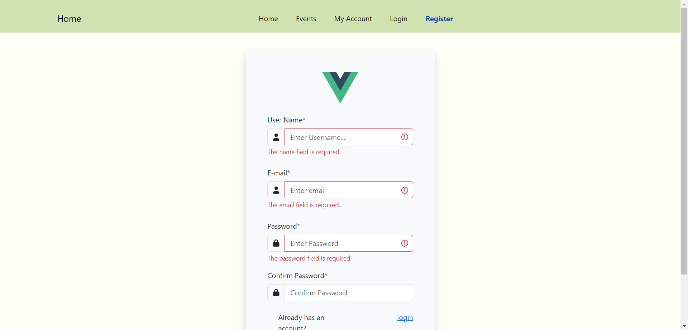

## When register then go event page.

## 3. Login:

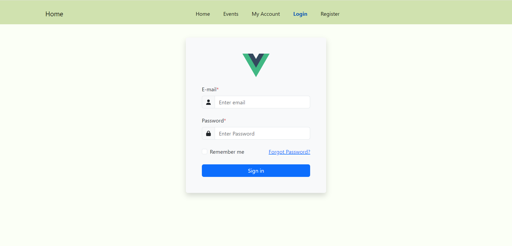
With Error
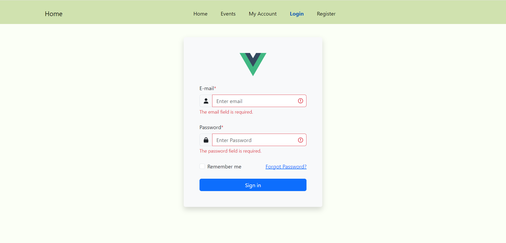

## 4. Event List with search, sort and pagination

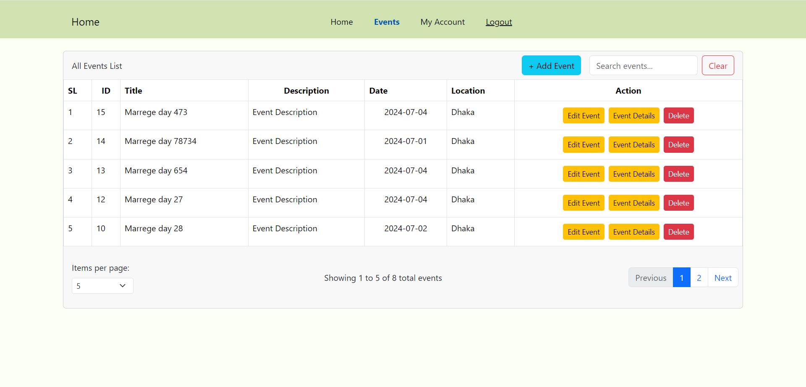

## 5. Event Create with sent user mail notification

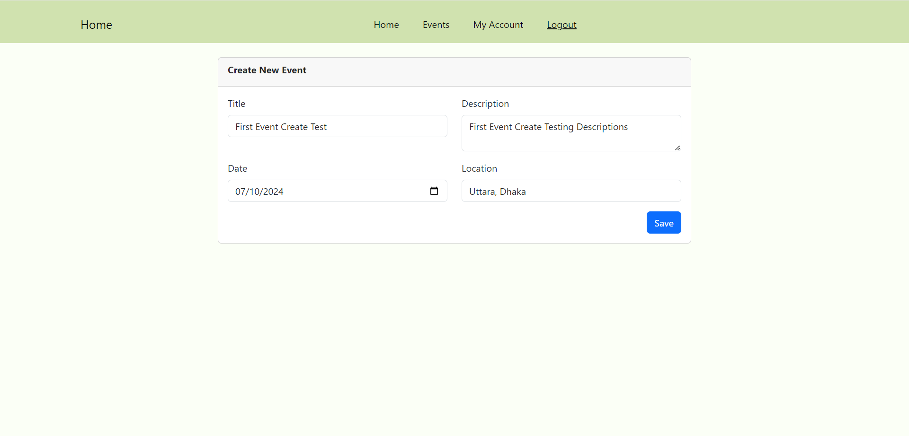

## Event Create with Validation

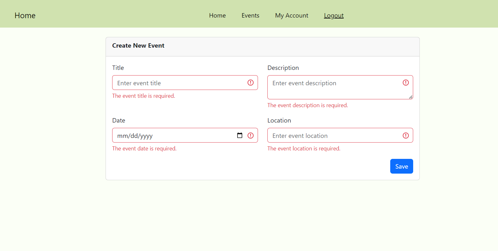

## 6. Event Create Mail

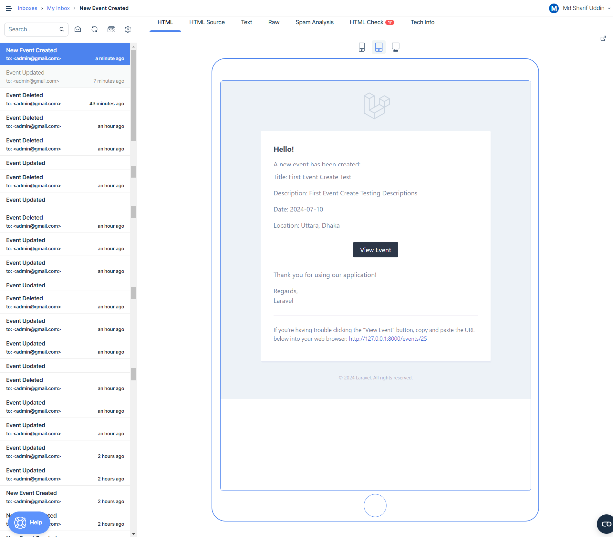

## 6. Event edit

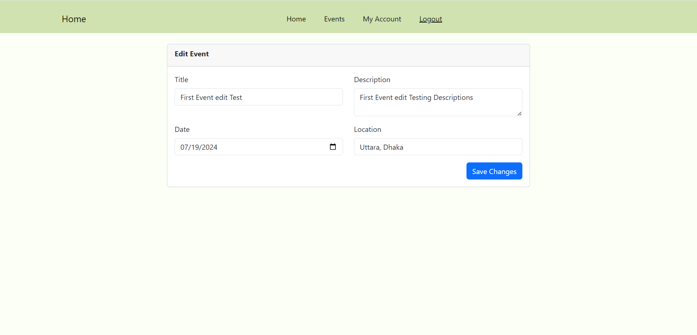

## 7. Event edit Mail

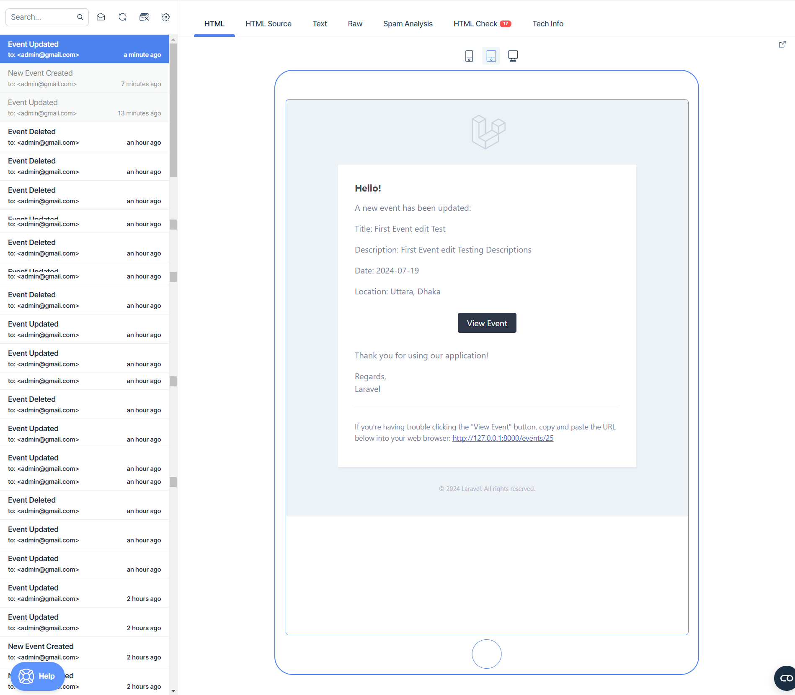

## 7. Event delete

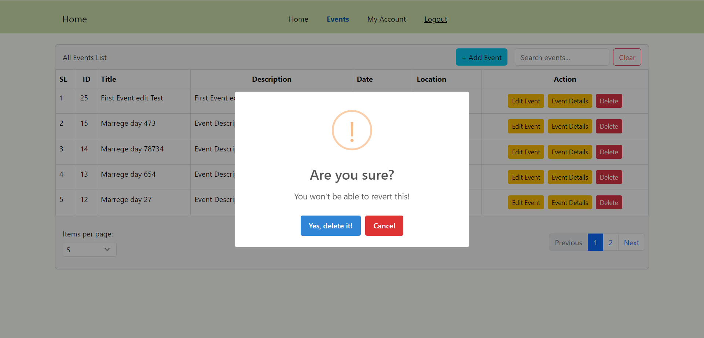

## 9. Event delete Mail

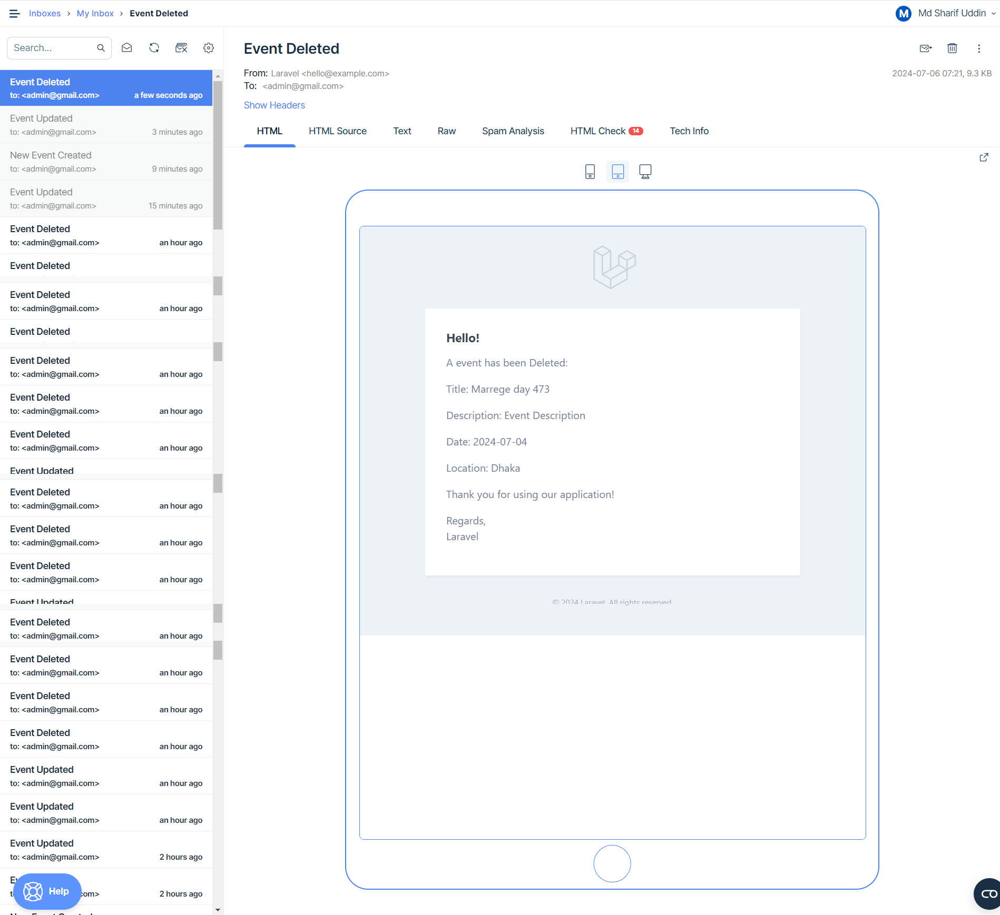

## 8. Event details

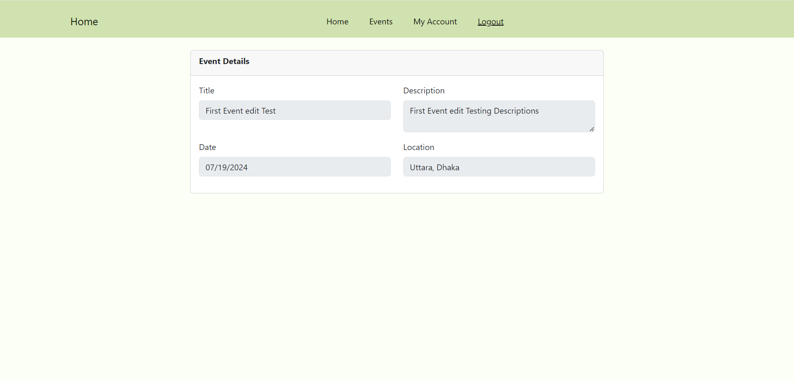

## 9. My account info

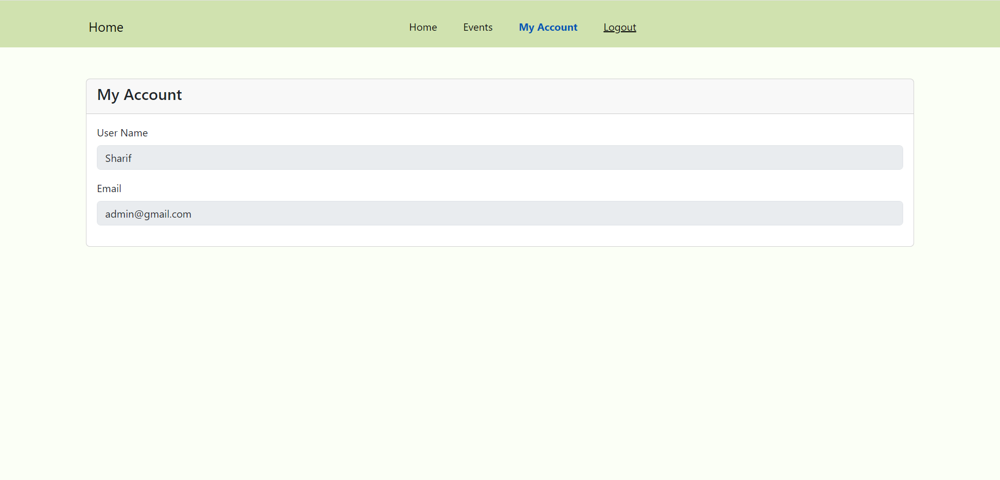
